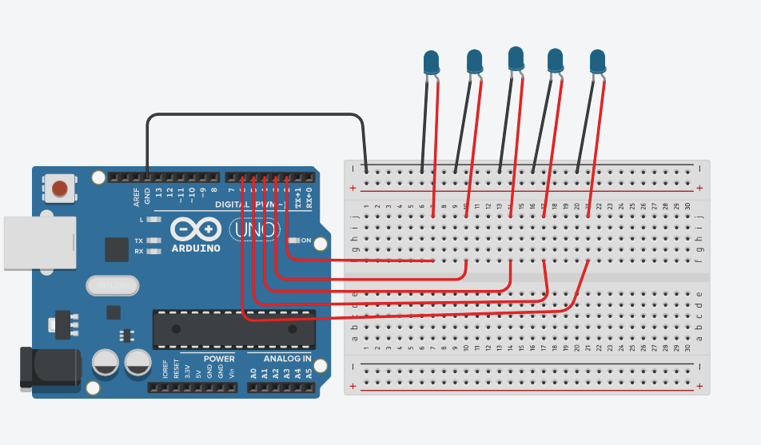

# Finger Counting LED Control with Python and Arduino

This project combines Python and Arduino to control five LEDs based on finger counting detected through a webcam. The Python script uses OpenCV and MediaPipe to count the number of fingers shown to the camera and sends this data to the Arduino, which then controls the LEDs accordingly.

## Features
- Real-time finger counting using a webcam.
- Control of up to five LEDs based on the number of fingers detected.
- Interactive and responsive feedback from hardware.

## Components Used
- **Arduino Uno** (or compatible board)
- **5 LEDs**
- **5 Resistors** (220Ω each)
- **Jumper wires**
- **Breadboard**
- **USB cable** (to connect Arduino to the computer)
- **Webcam** (for finger detection)

## Circuit Diagram
  <!-- Include your circuit diagram here if you have one -->

## Connections
- **LED 1**: Anode to pin 2 on Arduino, cathode to GND through a 220Ω resistor.
- **LED 2**: Anode to pin 3 on Arduino, cathode to GND through a resistor.
- **LED 3**: Anode to pin 4 on Arduino, cathode to GND through a resistor.
- **LED 4**: Anode to pin 5 on Arduino, cathode to GND through a resistor.
- **LED 5**: Anode to pin 6 on Arduino, cathode to GND through a resistor.

## Software Requirements
- **Python 3.x**
- **OpenCV** (`pip install opencv-python`)
- **MediaPipe** (`pip install mediapipe`)
- **PySerial** (`pip install pyserial`)
- **Arduino IDE** (for uploading code to Arduino)

## Installation and Setup

1. **Clone the repository**:
    ```bash
    https://github.com/Lokimux/FingerLED-Control.git
    ```

2. **Install required Python libraries**:
    ```bash
    pip install opencv-python mediapipe pyserial
    ```

3. **Upload the Arduino code**:
    - Open `arduino_code.ino` in the Arduino IDE.
    - Select your board and port.
    - Upload the code to your Arduino.

4. **Run the Python script**:
    - Connect the Arduino to your computer.
    - Run the Python script:
    ```bash
    python finger_counting.py
    ```

## How It Works
- The Python script captures video from the webcam and uses MediaPipe to detect the hand and count the number of fingers.
- It then sends the finger count (0-5) to the Arduino over serial communication.
- The Arduino receives this data and turns on the corresponding number of LEDs.

## Troubleshooting
- **No response from LEDs**: Ensure the Arduino is properly connected to the correct port. Check the serial connection in the Python script.
- **LEDs not lighting up**: Verify that the LEDs and resistors are connected correctly. Ensure the anodes and cathodes are correctly oriented.

## Future Enhancements
- Implement support for controlling more devices based on finger gestures.
- Improve finger detection accuracy in various lighting conditions.

## License
This project is licensed under the MIT License. See the [LICENSE](LICENSE) file for more details.

## Acknowledgments
- [MediaPipe](https://mediapipe.dev/) for hand tracking.
- [OpenCV](https://opencv.org/) for computer vision processing.

